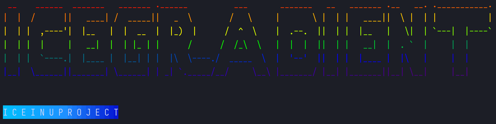

# 🧊IceGradient



简单又方便的Go渐变色文字生成工具，给你的控制台输出增加一点趣味。

Simple and convenient Go gradient text generator, add some fun to your console output.

## 特性 Features

- ANSI颜色和RGB颜色的互相转换 ANSI color and RGB color conversion
- 内置ANSI标准颜色和大量扩展色 Built-in ANSI standard colors and a large number of extended colors
- 高度可自定义的渐变色文字生成 Highly customizable gradient text generation
- 内置的渐变色模板 Built-in gradient color templates
- 支持渐变色背景！ Support gradient background!
- 支持任意颜色混合 Support arbitrary color blending

## 安装 Installation

```bash
go get -u github.com/Iceinu-Project/IceGradient
```